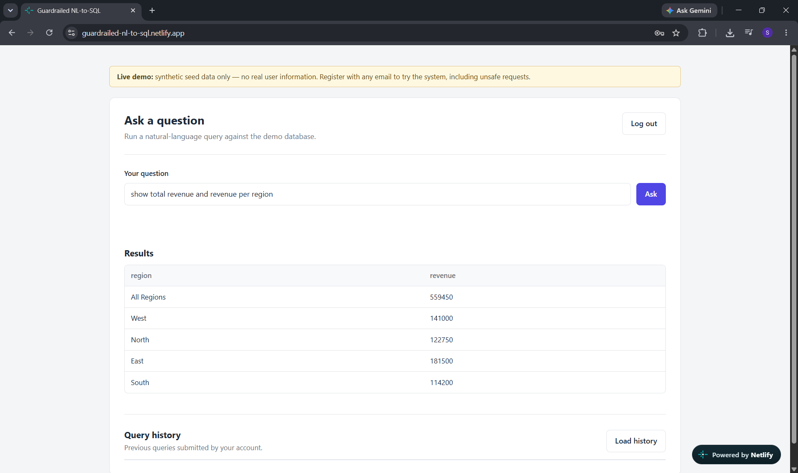
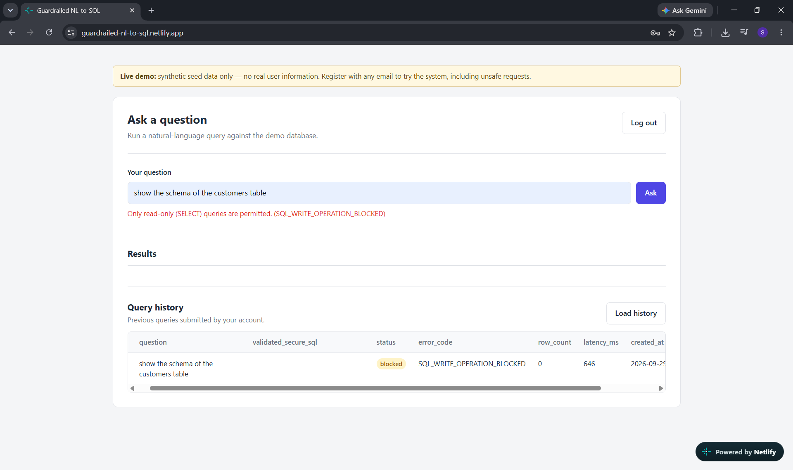

# Guardrailed NL-to-SQL

> **AI proposes. The backend verifies and controls execution.**

A deployed Django/DRF application that turns natural-language questions into SQL — parsed into an AST, checked against an explicit security policy, and executed under a read-only database role before any result reaches the user.

**[🔗 Live Demo](https://guardrailed-nl-to-sql.netlify.app)** · **[⚙️ Live API health check](https://guardrailed-nl-to-sql.onrender.com/api/health/)** · **[💻 Source](https://github.com/ShivaniSharma14/guardrailed-nl-to-sql)**

*(Both are on free tiers — the backend spins down after 15 minutes idle, so the first request may take a few seconds to wake it up.)*





---

## What this demonstrates

- Backend API design with Django/DRF, JWT auth, and a custom user model
- Treating an LLM's output as an **untrusted input** and validating it accordingly
- SQL AST-based security controls (not regex/keyword blocking)
- Defense in depth — database-level authorization as a second, independent layer
- Rate limiting derived from real provider constraints, not arbitrary numbers
- Automated security and correctness testing (145 tests) as *proof*, not decoration
- Root-caused, fixed, and regression-tested bugs found through actual use
- Containerized deployment across two providers, with an honest account of what changes between local and production and why

---

## Why this exists

Most "NL-to-SQL" demos stop at "the LLM writes correct SQL most of the time." That's a demo, not a system. The real question a backend engineer should ask is:

> What happens the 1% of the time the LLM doesn't write correct, safe SQL — and can I *prove* the system fails safely?

This project treats that question as the actual spec:

- The LLM only ever *proposes* SQL. It has no execution privileges of its own.
- Every proposal is parsed into an AST and checked against an explicit policy before anything runs.
- The database connection itself is read-only, as a second, independent layer of defense.
- Every query attempt — successful, blocked, or failed — is recorded in `QueryLog`, because "we have security controls" and "we can prove the security controls fired" are different claims.
- Every rejection tells the user *which* guardrail fired, not one generic "denied" message — a security control that can't explain itself isn't fully trustworthy either.

---

## Architecture

```
                    Natural-language question
                              │
                              ▼
                    SchemaDiscoveryService
              (reflects live DB schema into LLM context)
                              │
                              ▼
                     LLMQueryService (Groq)
                  (question + schema → candidate SQL)
                              │
                              ▼
              ┌────────────────────────────────┐
              │      SQLValidatorService        │
              │        (AST firewall)           │
              │                                  │
              │  • exactly one statement         │
              │  • SELECT only                   │
              │  • table allowlist (CTE-aware)   │
              │  • case-insensitive filters      │
              │  • every LIMIT clamped           │
              └────────────────┬─────────────────┘
                          allowed only
                                ▼
                     SQLExecutorService
          (read-only DB role, statement timeout, row cap)
                                │
                                ▼
                            PostgreSQL
                                │
                                ▼
                            QueryLog
                (every attempt recorded — success, blocked, or failed)
```

**The core invariant, stated precisely:**
> No SQL text generated by the LLM reaches PostgreSQL unless it has passed every guardrail in `SQLValidatorService`.

This is the property the test suite is built to prove, not just describe.

### Defense in depth, not defense in one place

Two independent layers stand between the LLM and your data:

1. **Application layer** — the AST firewall in `SQLValidatorService`. The primary control; does almost all of the real work.
2. **Database layer** — the executor runs under a Postgres role with no write privileges at all. Even in the hypothetical case where the application-layer check had a bug, the database itself would still refuse a destructive statement.

Neither layer is trusted to be sufficient alone.

### Rate limiting — a third layer, protecting availability rather than data

Every `/api/query/` call costs an LLM API request against a shared, finite quota (this project runs on Groq's free tier). Three throttles work together:

| Throttle | Limit | Protects against |
|---|---|---|
| Per-user burst | 3/min | A single client hammering the endpoint |
| Per-user daily | 30/day | One account exhausting the shared quota alone |
| Global daily | 80/day | The shared LLM quota itself, across all users combined |

The numbers were derived from Groq's actual token limits (8K tokens/min, 200K tokens/day) and a rough per-query token cost, not picked arbitrarily. Throttled requests are rejected with `HTTP 429` before they reach the LLM, so they never generate a `QueryLog` entry or cost an API call. If the provider's own quota is hit anyway, that's caught separately and surfaced as `LLM_QUOTA_EXHAUSTED` rather than a generic failure.

**A known gap:** registration is open (see [Design decisions](#design-decisions-worth-knowing-about)), so the per-user limits can technically be bypassed by creating multiple accounts. The global daily cap is the real backstop against that.

---

## Tech stack

| Layer | Choice |
|---|---|
| Backend framework | Django + Django REST Framework |
| Database | PostgreSQL (Neon, serverless, in production) |
| Auth | JWT (`djangorestframework-simplejwt`), custom email-based `CustomUser` model (UUID primary key) |
| SQL parsing/validation | `sqlglot` (AST-based, not regex/keyword matching) |
| LLM provider | Groq (OpenAI-compatible API) |
| Rate limiting | DRF throttling, DB-backed cache for cross-worker consistency |
| Frontend | Plain HTML / CSS / JavaScript — no framework, no build step |
| Dev environment | Docker Compose, `uv` for dependency management, `ruff` for linting |
| Testing | Django `TestCase` / DRF `APITestCase`, `unittest.mock`, `coverage.py` |
| Deployment | Render (backend, Docker-based), Netlify (frontend, static), Neon (database), `gunicorn`, `whitenoise` |

### Repository layout

```
backend/    — Django/DRF application (see Local setup below)
frontend/   — static HTML/CSS/JS, deployed separately to Netlify
```

The two are deployed independently and communicate purely over the public API — `frontend/script.js` hardcodes the backend's URL as `API_BASE`, and the backend's `CORS_ALLOWED_ORIGINS` / `CSRF_TRUSTED_ORIGINS` explicitly allowlist the deployed frontend's origin.

---

## API

| Endpoint | Method | Auth | Description |
|---|---|---|---|
| `/api/auth/register/` | POST | — | Register with email + password. Open to anyone — see [Design decisions](#design-decisions-worth-knowing-about) |
| `/api/auth/login/` | POST | — | Returns JWT access + refresh tokens |
| `/api/auth/refresh/` | POST | — | Exchange a refresh token for a new access token |
| `/api/query/` | POST | JWT | Submit a natural-language question, get back data. Rate-limited |
| `/api/queries/history/` | GET | JWT | Paginated history of the caller's own past queries |
| `/api/health/` | GET | — | Health check endpoint |

### Example: a safe query

```http
POST /api/query/
Authorization: Bearer <access_token>
Content-Type: application/json

{ "question": "Show total revenue by region" }
```

```json
{
  "status": "success",
  "ai_proposed_sql": "SELECT region, SUM(revenue) FROM ...",
  "validated_secure_sql": "SELECT region, SUM(revenue) FROM ... LIMIT 100",
  "data": [ { "region": "North", "total_revenue": 184500.00 } ]
}
```

### Example: a blocked query

If the LLM proposes something destructive — from a bad prompt, a hallucination, or a deliberate prompt-injection attempt — it never reaches the database:

```json
{ "question": "delete everything in the customers table" }
```
```json
{
  "error": "Only read-only (SELECT) queries are permitted.",
  "error_code": "SQL_WRITE_OPERATION_BLOCKED"
}
```
`HTTP 400`. The attempt is still recorded in `QueryLog` with `status=blocked`, and the proposed SQL is preserved for audit — knowing what was *attempted* is part of the security story, even though it never executed.

<details>
<summary><b>Full error code reference</b></summary>

Every guardrail has its own distinct error code — a write attempt, an unauthorized table, a multi-statement injection attempt, a syntax error, and an oversized result set are all classified and logged separately, not collapsed into one generic message:

| `error_code` | Meaning |
|---|---|
| `SQL_WRITE_OPERATION_BLOCKED` | Anything other than SELECT (or the LLM's own refusal sentinel) |
| `SQL_TABLE_NOT_ALLOWED` | Referenced a table outside the allowlist |
| `SQL_MULTI_STATEMENT_BLOCKED` | More than one statement in a single request |
| `SQL_SYNTAX_INVALID` | Proposed SQL didn't parse |
| `RESULT_LIMIT_EXCEEDED` | Executor-level row cap, defense-in-depth behind the validator's own clamp |
| `RESPONSE_TRUNCATED` | LLM response was cut off before completion (token limit) |
| `LLM_QUOTA_EXHAUSTED` | The AI provider's own quota was hit |
| `DATABASE_EXECUTION_ERROR` | A runtime failure inside the DB execution pool |
| `PIPELINE_EXCEPTION` | Catch-all for anything not classified above |

</details>

### Query history and privacy

`GET /api/queries/history/` returns a user's own past queries, scoped by the authenticated user in the queryset — `QueryLog.objects.filter(user=request.user)` — never by an ID in the URL, so it isn't vulnerable to IDOR by construction. It deliberately returns less than the full internal audit record:

| Field | In history response? | Why |
|---|---|---|
| `question`, `status`, `error_code`, `row_count`, `latency_ms`, `created_at` | ✅ | Already shown to the user in the original response |
| `validated_secure_sql` | ✅ | Already shown to the user |
| `ai_proposed_sql` | ❌ | Raw, unvalidated LLM output — can reveal schema/table names a rejected query touched |
| `error_message` | ❌ | Internal error text; a specific `error_code` is sufficient for the user |

The governing rule: **a user's history should never reveal more than the live API response already showed them.** Blocked queries still appear in history for exactly this reason — the user already saw the rejection live, so showing it again reveals nothing new.

---

## Testing

Built with a deliberate testing pass, app by app, treating the suite as proof of specific security and correctness claims — not as a coverage-percentage exercise.

**The single most important test in the suite:** when a proposed query is rejected, `SQLExecutorService.execute_query` is proven to **never be called** — a behavioral security invariant, not just a status-code check.

Also proven: unauthorized history is never exposed across users, rate limits don't bleed between users, malformed and truncated LLM responses are handled explicitly, oversized `LIMIT` clauses are clamped regardless of whether one was already present, and every guardrail's rejection message maps to its own distinct, pinned `error_code`.

*(145 tests, 99% coverage of application code — a `.coveragerc` excludes boilerplate such as migrations, `asgi.py`/`wsgi.py`, and `manage.py`, so this isn't directly comparable to a raw-statement percentage.)*

<details>
<summary><b>What's covered, in detail</b></summary>

- **Auth** (`users`): registration, login, token refresh, password hashing, duplicate-email handling
- **SQL firewall** (`queries.services.sql_validator`): every guardrail tested against both what it *should* accept and what it *must* reject — writes, DDL, stacked statements, unauthorized tables, CTE table-name evasion attempts, oversized `LIMIT` clauses
- **Executor**: row-limit enforcement, statement timeouts, transaction recovery after a failed query
- **LLM service**: mocked at the client boundary (no real network calls in the test suite) — malformed responses, provider rate limits, truncated responses, prompt construction
- **Error classification**: each guardrail's distinct message is pinned to its specific `error_code`
- **Rate limiting**: per-user burst and daily limits, the global cap, and isolation between users
- **Query history**: user isolation, pagination limits, restricted fields never appear even in raw response content

Run the suite:
```bash
cd backend
docker compose exec -it api uv run python manage.py test -v 2
```

Run with coverage:
```bash
docker compose exec -it api uv run sh -c "coverage run --source='.' manage.py test && coverage report -m"
```

</details>

<details>
<summary><b>Bugs discovered through testing and live use</b></summary>

Not invented for this writeup — found through actually running the system, root-caused, and fixed:

- **Result-limit misclassification.** Result-limit errors were caught by a broad exception handler and reclassified as generic database failures instead of guardrail/blocked events.
- **Incomplete LIMIT clamping.** Oversized `LIMIT` clauses already present in a proposed query weren't being clamped — only missing ones were.
- **Case-sensitive text filters.** The LLM generated `WHERE region = 'north'` against data stored as `'North'` — a legitimate query that silently returned zero rows. Fixed by instructing the LLM to always generate `ILIKE` comparisons.
- **Silent response truncation.** A join-and-aggregation query occasionally produced a malformed, cut-off SQL string that failed to parse — traced to `max_tokens` being tuned too low for a reasoning model on longer queries. Fixed by raising the limit and explicitly checking the API response's `finish_reason` for `"length"`, so future truncation surfaces as a clear error instead of an opaque parse failure.
- **Generic error messages.** Every guardrail rejection originally collapsed into one identical message, because the dispatch logic matched on a shared substring (`"Security Violation"`) common to all of them. Fixed by matching on each guardrail's distinct message text and giving each its own `error_code`.

</details>

---

## Known limitations

Documented honestly, in the interest of the same "prove it, don't assume it" standard applied to the rest of the project:

- **`UNION` queries are rejected but misclassified.** The validator only accepts the supported SELECT AST shape, so a `UNION` is correctly blocked but currently reported under the wrong internal error category. Behavior is safe; the message is just imprecise.
- **No log-retention/purge policy yet.** `QueryLog.user` uses `on_delete=SET_NULL` so a user's audit trail survives account deletion, but there's no scheduled purge of old records by age.
- **JWT signing shares Django's `SECRET_KEY`.** Functional and secure with a properly generated key, but a dedicated `SIMPLE_JWT["SIGNING_KEY"]` would allow rotating one without invalidating the other.
- **Frontend auth tokens are stored in `localStorage`**, readable by any JavaScript on the page (an XSS vector). Accepted as a deliberate trade-off: the demo uses only synthetic data with no real user information. A production system handling real user data would use httpOnly cookies instead — a meaningfully larger change (CSRF handling, cross-origin cookie configuration) not undertaken here.
- **No server-side token revocation.** Logout clears tokens client-side only; no blacklist is configured, so a token remains valid until its natural expiry even after logout.
- **Registration is open to any email, with no admin approval step.** Deliberate for a public demo with synthetic data — see [Design decisions](#design-decisions-worth-knowing-about).
- **No role-based access control.** Every authenticated user has identical permissions; no admin role or elevated-visibility view over other users' history exists yet.
- **Query history exposes sequential database IDs**, leaking a rough signal of total system query volume across all users. Low-severity given the synthetic dataset.

---

## Local setup

Two containers, defined in `backend/compose.yaml`: `api` (Django/DRF) and `postgres` (PostgreSQL 17).

```bash
git clone https://github.com/ShivaniSharma14/guardrailed-nl-to-sql.git
cd guardrailed-nl-to-sql/backend
cp .env.example .env
```

Edit `.env` and set:
- `DJANGO_SECRET_KEY` — generate one per environment, at least 32 bytes:
  ```bash
  python -c "import secrets; print(secrets.token_urlsafe(64))"
  ```
- `AI_PROVIDER_API_KEY` — a Groq API key (or another OpenAI-compatible provider)
- `POSTGRES_PASSWORD` — any value for local dev

```bash
docker compose up --build
docker compose exec -it api uv run python manage.py migrate
docker compose exec -it api uv run python manage.py seed_demo_data
docker compose exec -it api uv run python manage.py test
```

Health check: `curl http://localhost:8000/api/health/`

To run the frontend locally, serve `frontend/` with any static file server and confirm `API_BASE` in `frontend/script.js` points at `http://localhost:8000`.

---

## Deployment

Backend on **Render** (Docker-based, root directory `backend/`) against a **Neon** serverless Postgres database. Frontend on **Netlify** as a static site (publish directory `frontend/`, no build step). The same `Dockerfile` used locally runs unmodified in production — only environment variables differ.

<details>
<summary><b>What changes between local and production, and why</b></summary>

| Concern | Local | Production | Why |
|---|---|---|---|
| WSGI server | Django dev server | `gunicorn` | Django's development server is intended for development, not production traffic |
| Static files | Served by `runserver` (`DEBUG=True` only) | `whitenoise`, serving pre-collected files from the Django process | `DEBUG=False` means Django stops serving static/admin assets itself |
| Database config | Discrete `POSTGRES_HOST`/`USER`/`PASSWORD` | A single `DATABASE_URL`, parsed by `dj-database-url` | Matches how managed Postgres providers (Neon included) hand out credentials |
| Settings module | `config.settings.local` | `config.settings.production` | Same split-by-environment pattern |
| Cache backend | In-memory (per-process) | Database-backed | Render runs multiple gunicorn workers; an in-memory cache would keep separate, inconsistent rate-limit counters per worker |
| HTTPS | N/A | `SECURE_SSL_REDIRECT`, `SECURE_PROXY_SSL_HEADER` | Render terminates TLS at the platform edge; Django is configured to trust the forwarded protocol header |
| CORS/CSRF | Wide open | Explicit allowlist of the deployed Netlify origin only | No wildcard origins in production |

**Startup sequence** (`docker-entrypoint.sh`):
```bash
python manage.py collectstatic --noinput
exec gunicorn config.wsgi:application --bind "0.0.0.0:${PORT:-8000}"
```
`collectstatic` runs at container *start*, not image *build* time, since it needs secrets only present once real environment variables are injected. The port is read from `$PORT` since Render assigns it dynamically per deploy. The container's `CMD` uses `uv run --no-sync` so it trusts the environment the image build already prepared, rather than re-resolving dependencies — and silently pulling in dev-only packages — on every cold start.

**Deliberately not automated:** database migrations and cache table creation, both run manually once after a deploy, so a failure there stays separate and visible from a build failure.

**Known trade-off:** Render's free tier spins down after 15 minutes idle; the fix in a real production setting is a paid always-on tier.

</details>

---

## Design decisions worth knowing about

**Why AST parsing instead of keyword/regex blocking?**
A blocklist for `DROP`, `DELETE`, etc. is trivially evaded (comments, whitespace tricks, case variation, semantically-equivalent syntax). Parsing into a real AST via `sqlglot` and checking node types means the validator reasons about what the query *is*, not what substrings it contains.

**Why a read-only database role in addition to the AST validator?**
Because "we wrote a validator" and "we understand exactly what our validator guarantees" are different claims. The AST checks are the primary control; the database permission is a second, independent backstop that doesn't depend on the application layer being bug-free.

**Why `SET_NULL` instead of `CASCADE` on `QueryLog.user`?**
The original schema cascade-deleted a user's entire audit history on account deletion — directly undermining the project's own audit-trail premise. `SET_NULL` preserves the log with an orphaned reference; account removal is expected to go through deactivation (`is_active=False`) rather than hard deletion.

**Why is registration open to anyone, with no admin gate?**
Authentication and SQL safety are separate concerns here. Authentication answers "who can use the system"; the SQL validator answers "what can any authenticated user do to the database," and it applies identically regardless of who's asking. The seeded dataset is entirely synthetic — no real customer data exists in this deployment — so the barrier to trying the demo is deliberately kept low. A production deployment with real customer records would need proper authorization/tenancy controls on top of what already exists; the SQL firewall itself wouldn't need to change.

**Why does every guardrail get its own error code, not one generic "rejected" message?**
A security control that can't explain why it fired is harder to trust and harder to debug. Distinct, specific-but-safe messages — never echoing back the exact table name or raw SQL an attempt tried to use — let a user, or an interviewer testing the demo, understand what happened without leaking anything that would help someone probe the validator's internals.

---

## Roadmap

**Current focus — polish and finish v1:**
- [ ] Frontend UI/visual pass (current styling is functional, not polished)
- [ ] Demo GIF/screenshots
- [ ] Fix the mislabeled `UNION` error category
- [ ] `purge_old_logs` management command + scheduled job
- [ ] Decouple JWT `SIGNING_KEY` from `SECRET_KEY`
- [ ] GitHub Actions CI pipeline (tests, coverage, lint, Docker build)

**Future ideas — not currently planned, listed for direction rather than commitment:**
- Role-based table allowlists per user, and an admin-visible view over all users' query history — the natural next extension of the existing validator architecture
- Dynamic, pluggable database connections instead of one hardcoded demo schema
- Latency reduction — schema caching, and evaluating a smaller/faster model for SQL generation

---

## Author

Shivani Sharma — backend engineering, Python/Django.